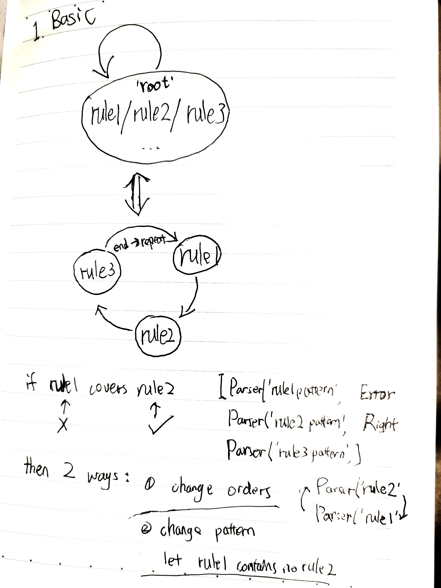
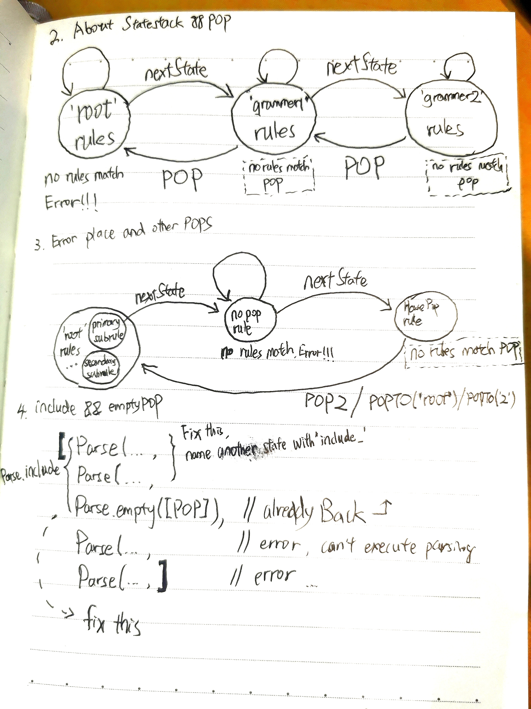
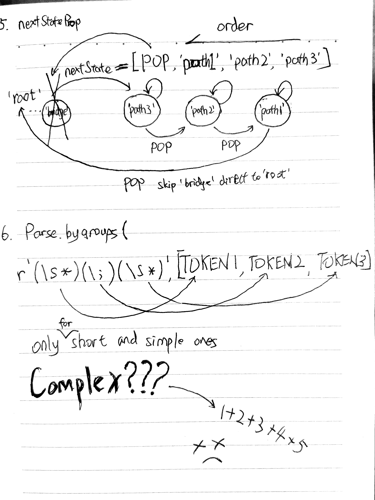

# lexpro

Lexers for different languages in Dart with Regular Expressions adapted from
 the awesome [pygments](https://pygments.org) library.

# Tutoring
## 1. Basic Looping && Cover Relationship

## 2. Statestack && POP
## 3. Error occurs place && other kind of POPS
## 4. Include && Empty

## 5. How to use nextState prop
## 6. Parse.bygroups && strategies combine above all 1+2+3+4+5

I think you can handle it.Learn by tests.Especaily newly added `lexers/senior/dart_import_test.dart` it supports senior grammer build.