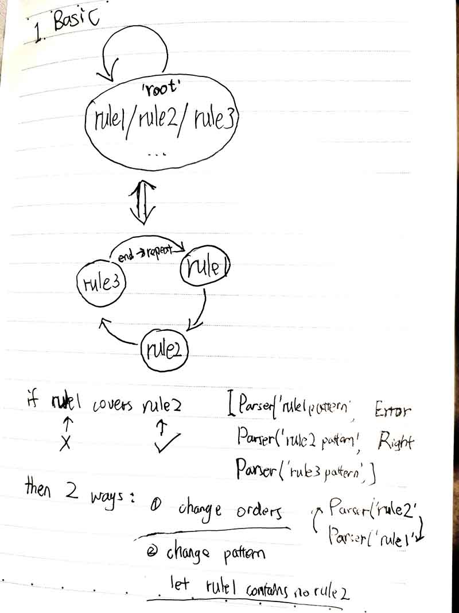
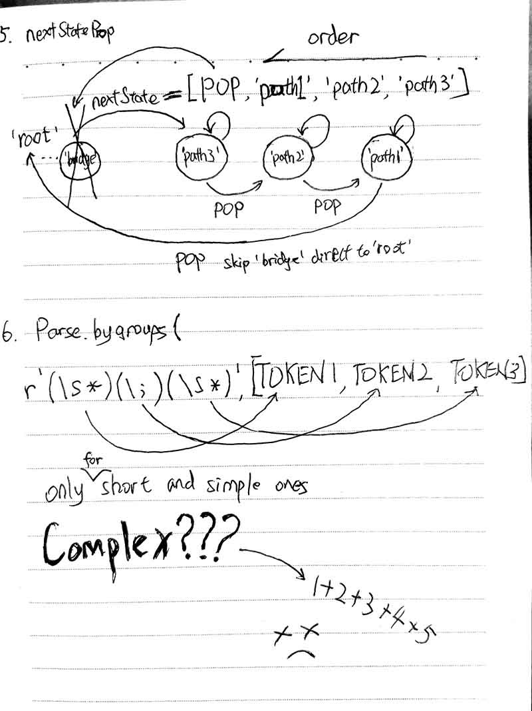

# lexpro
If picture can not be seen, read me at [github](https://github.com/zhuofaner/lexpro-dart).

You can also learn from `example.dart`, it's so easy and full with comments.

Intro: Lexers for different languages in Dart with Regular Expressions adapted from
 the awesome [pygments](https://pygments.org) library.

 Edit and Add new features by [jackyanjiaqi](https://github.com/jackyanjiaqi)
 

# Tutoring
## 1. Basic Looping && Cover Relationship

## 2. Statestack && POP
## 3. Error occurs place && other kind of POPS
## 4. Include && Empty

## 5. How to use nextState prop
## 6. Parse.bygroups && strategies combine above all 1+2+3+4+5

I think you can handle it.Learn by tests.Especaily newly added `lexers/senior/dart_import_test.dart` it supports senior grammer build.